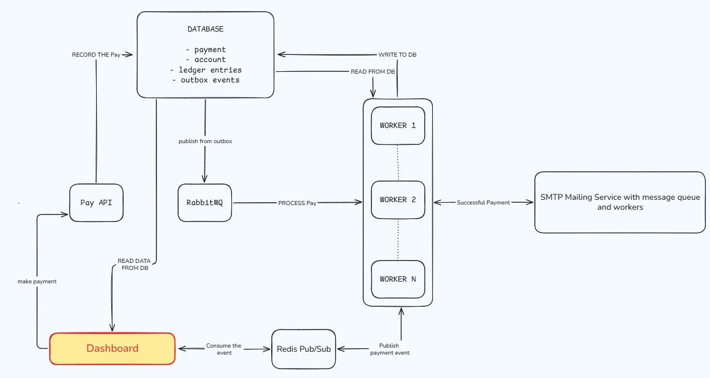
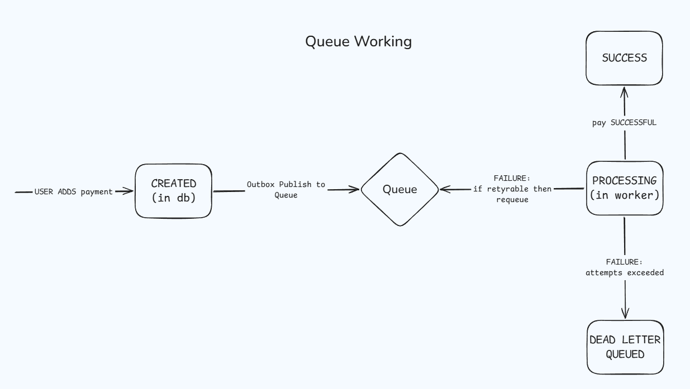
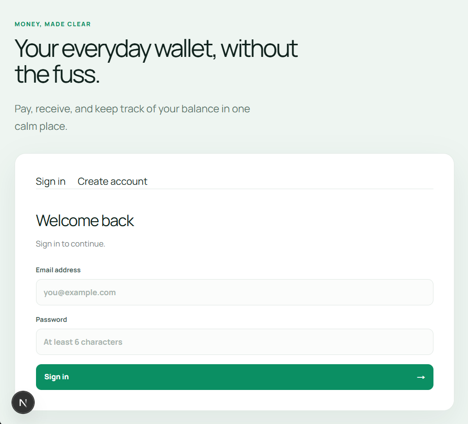
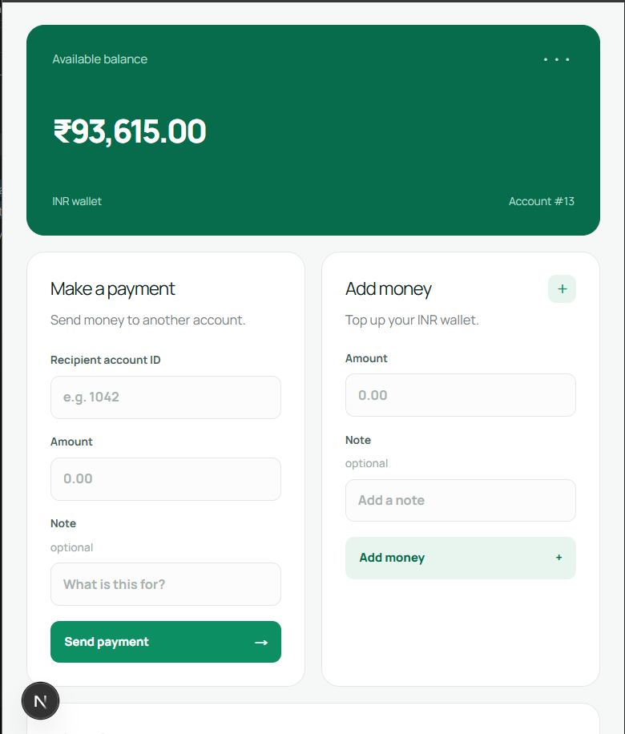

# Distributed Payment Processing System

A full-stack wallet and payment processing system built around asynchronous workers, PostgreSQL transactions, RabbitMQ messaging, and operational monitoring.

The system lets authenticated users create accounts, send transfers, add money through deposits, view balances and payment history, and receive real-time payment status updates in the web dashboard.

## Tech Stack

- **Frontend:** Next.js, React, TypeScript, CSS
- **Backend:** Node.js, TypeScript, Fastify
- **Database:** PostgreSQL
- **Messaging:** RabbitMQ, `amqplib`
- **Event updates:** Redis pub/sub and Server-Sent Events
- **Email:** Nodemailer with SMTP
- **Authentication and API protection:** JWT cookies, Argon2 password hashing, and Fastify IP-based rate limiting
- **Observability:** Prometheus metrics, Grafana, Pino structured logs
- **Testing support:** k6 load-test script in `load-test.js`

## Simple Architecture Overview





## How the System Works

### 1. Frontend and API request

The Next.js frontend provides login, registration, dashboard, transfer, deposit, logout, balance, and payment-history screens. API calls use the `/api/*` rewrite to reach the Fastify server on port `3000`.

The backend authenticates users with JWTs stored in HTTP-only cookies. Account-specific endpoints compare the authenticated account ID with the requested account ID before returning private data or accepting deposits.

The API also registers `@fastify/rate-limit` with a global limit of 100 requests per IP per minute. Sensitive and frequently used routes define stricter limits: registration and login allow 5 requests per minute, payment and deposit creation allow 30 requests per minute, and account, ledger, and payment-history reads allow 60 requests per minute. This reduces brute-force attempts and limits accidental or abusive request bursts. The current configuration uses the default in-memory store, so it is intended for the local single-process setup rather than coordinated limits across multiple API instances.

### 2. Creating a payment

A transfer or deposit request is accepted by the API and returns `202 Accepted` after the following PostgreSQL transaction completes:

1. Insert a `pending` payment record.
2. Insert a matching `PAYMENT_CREATED` record in `outbox_events`.
3. Commit both records together.

The API does not wait for the balance update or email delivery. This keeps the request path separate from slower downstream work.

Payment creation is protected by JWT authentication and a route-level limit of 30 requests per IP per minute before the request reaches the controller.

### 3. Transactional Outbox publisher

The publisher process runs on port `4000`. It continuously finds outbox events where `published_at` is null, publishes their payloads to RabbitMQ using a confirm channel, and marks them as published after RabbitMQ confirms the message.

The outbox protects the database-to-message handoff: if RabbitMQ is temporarily unavailable, the payment event remains in PostgreSQL for a later publishing attempt.

### 4. Payment worker

The payment worker runs on port `5000` and consumes `payment_queue` with manual acknowledgements and `prefetch(1)`.

For a transfer, it:

1. Locks the payment row.
2. Locks sender and receiver account rows in account-ID order.
3. Checks that both accounts exist.
4. Checks that the sender has enough balance.
5. Debits the sender and credits the receiver.
6. Marks the payment as completed.
7. Inserts debit and credit ledger entries.
8. Commits all database changes in one PostgreSQL transaction.

Deposits use the same worker model but credit the target account and create a credit ledger entry.

The row locks and database transaction prevent concurrent workers from applying conflicting balance updates within the processing transaction.

### 5. Payment retries and DLQ

When a worker encounters a retryable failure, it republishes the message to one of three TTL-based retry queues. The retry queues return the message to `payment_queue` after approximately 2, 4, and 8 seconds, with random jitter added to the delay.

After the retry limit is reached, the worker publishes the message to `payment_dlq` and acknowledges the original message so it is removed from the active queue.

### 6. Real-time dashboard updates

The payment worker publishes processing and completion/failure events to Redis on `payment.updated`. The API subscribes to that channel and maps events to the connected account's Server-Sent Events connection.

The frontend listens for the `payment.updated` event, updates the matching payment row, displays a status notice, and refreshes the account balance and history.

### 7. Email notifications

After a successful payment, the payment worker publishes notification messages to `mail_queue`:

- A transfer creates one message for the sender and one for the receiver.
- A deposit creates one message for the account owner.

The mail worker runs on port `6000`. It loads payment and account details from PostgreSQL, determines the recipient role, generates text and HTML content, and sends the message through Nodemailer and the configured SMTP server.

Email failures use separate retry queues and eventually `mail_dlq`. Email processing is intentionally separated from payment processing so SMTP failures do not block the payment API.

### 8. Monitoring and logging

Each backend process exposes health and Prometheus endpoints:

| Process | Port | Purpose |
| --- | ---: | --- |
| API | `3000` | HTTP API, authentication, SSE, metrics |
| Publisher | `4000` | Transactional Outbox publisher |
| Payment worker | `5000` | Transfer and deposit processing |
| Mail worker | `6000` | Asynchronous email delivery |

Prometheus scrapes these endpoints. Metrics cover payment totals, failures, retries, processing duration, outbox activity, queue activity, email delivery, and in-progress work. Grafana is included in `backend/docker-compose.yml` as a visualization layer.

Structured logs are written to `backend/logs/` for API, publisher, worker, database, and mail activity.

## Running Locally

### Prerequisites

Install and start:

- Node.js
- PostgreSQL
- RabbitMQ
- Redis
- An SMTP provider for email testing
- Docker, if using the Prometheus and Grafana containers

Create `backend/.env` locally with the required connection strings and credentials. Do not commit real passwords, JWT secrets, SMTP passwords, or database URLs.

### Start the backend processes

Open separate terminals:

```powershell
cd backend
npm install
npm run start
```

```powershell
cd backend
npm run publisher
```

```powershell
cd backend
npm run pworker
```

```powershell
cd backend
npm run mworker
```

### Start the frontend

```powershell
cd frontend
npm install
npm run dev
```

The frontend development server uses port `8080` and proxies API requests to `http://localhost:3000`.

### Start monitoring

```powershell
cd backend
docker compose up -d
```

Prometheus is exposed on port `9090`; Grafana is exposed on port `3005`.

## Load Testing

The root `load-test.js` file contains a k6 scenario that ramps through 5, 10, and 25 virtual users and checks payment-request responses and latency thresholds.

Before running it, replace the empty JWT token with a valid test token and verify that the target account and local services are available:

```powershell
k6 run load-test.js
```

The script is a local test setup. The repository does not claim benchmark results or production-scale capacity from it.

## Repository Layout

```text
.
├── backend/
│   ├── apis/                 Fastify route registration
│   ├── controllers/          HTTP request handling
│   ├── messaging/            RabbitMQ, publisher, payment worker, mail worker
│   ├── middleware/           JWT authentication and request protection
│   ├── monitoring/           Prometheus configuration
│   ├── plugins/              Fastify integrations such as Nodemailer
│   ├── query/                Parameterized PostgreSQL query builders
│   ├── utils/                Logging, metrics, Redis, SSE, and helpers
│   └── index.ts              API process startup
├── frontend/
│   ├── app/                  Next.js routes and global styles
│   ├── components/           Authentication and dashboard UI
│   └── lib/api.ts            Frontend API and SSE client
├── docs/images/              Architecture diagrams and application screenshots
├── load-test.js              k6 load-test scenario
└── README.md
```

## Project Images

### Application Screenshots



